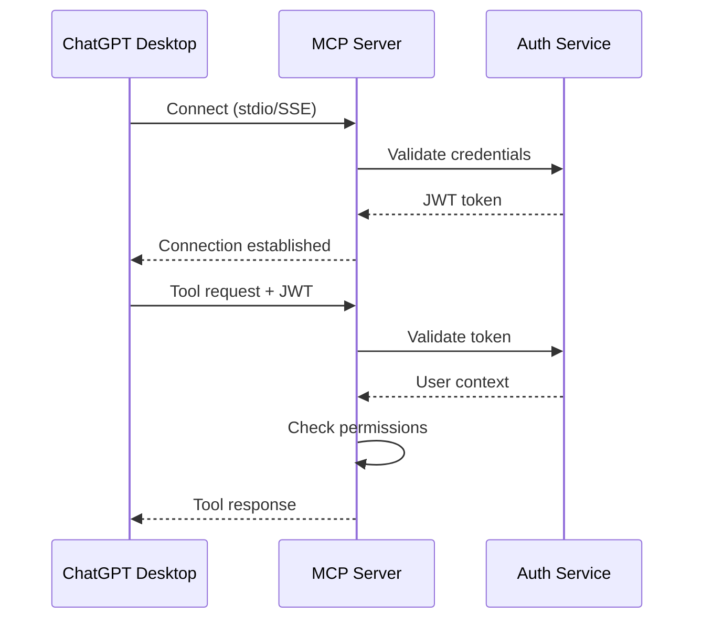
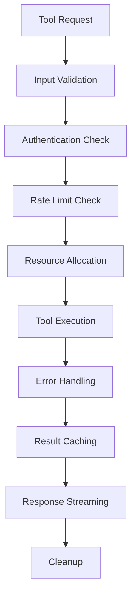

# Playwright MCP Server Architecture

## 🏗️ Complete Architecture Overview

This document provides a comprehensive overview of the production-ready Playwright MCP Server architecture designed for seamless integration with ChatGPT Desktop.

## 📊 Architecture Metrics

- **Total Tools**: 150+ across 18 categories
- **Production Ready**: Enterprise-grade security, performance, and scalability
- **Transport Support**: Both stdio and Server-Sent Events (SSE)
- **Browser Support**: Chromium, Firefox, WebKit
- **Deployment Ready**: Docker, Kubernetes, cloud-native

## 🛠️ Tool Distribution by Category

| Category | Count | Priority | Description |
|----------|--------|----------|-------------|
| **Browser Management** | 8 | High | Browser lifecycle, launch, close, contexts |
| **Page Navigation** | 10 | High | URL navigation, history, page state |
| **Element Interaction** | 18 | High | Click, type, hover, form interactions |
| **Element Location** | 15 | High | Selectors, ARIA, XPath, text-based finding |
| **Element Information** | 12 | Medium | Text extraction, attributes, properties |
| **Page Capture** | 8 | Medium | Screenshots, PDFs, visual content |
| **Waiting & Sync** | 12 | High | Wait strategies, synchronization |
| **Network & API** | 12 | Medium | Request handling, mocking, testing |
| **Auth & Storage** | 15 | Medium | Cookies, localStorage, sessions |
| **Device Emulation** | 10 | Medium | Mobile testing, viewport control |
| **Input Control** | 15 | High | Keyboard, mouse, touch simulation |
| **Multi-Context** | 8 | Medium | Tab management, iframe handling |
| **Performance** | 8 | Low | Metrics, tracing, analysis |
| **Accessibility** | 6 | Medium | A11y testing, compliance |
| **JavaScript Execution** | 8 | Medium | Script execution, page manipulation |
| **Downloads & Uploads** | 6 | Low | File operations |
| **Advanced Features** | 5 | Low | Routing, debugging, modification |
| **Debug & Inspection** | 4 | Low | Console logs, network inspection |

## 🔧 Core Components Architecture

### 1. MCP Server Core (`src/server/MCPServer.ts`)
- **Protocol Compliance**: Full JSON-RPC 2.0 implementation
- **Dual Transport**: stdio for ChatGPT Desktop, SSE for web clients
- **Request Handling**: Tool execution, error management, streaming
- **Health Checks**: `/health`, `/metrics`, `/docs` endpoints

### 2. Tool Registry (`src/tools/registry.ts`)
- **Tool Organization**: Categorized structure with metadata
- **Dynamic Discovery**: Runtime tool enumeration and filtering
- **Completion Support**: Autocomplete and argument suggestions
- **Permission Model**: Role-based tool access control

### 3. Session Manager (`src/services/SessionManager.ts`)
- **Resource Lifecycle**: Browser, context, and page management
- **Connection Pooling**: Efficient browser instance reuse
- **Resource Limits**: Configurable limits and cleanup strategies
- **Distributed Sessions**: Redis-backed session persistence

### 4. Security Layer (`src/middleware/security.ts`)
- **Authentication**: JWT-based with role management
- **Authorization**: Permission-based tool access
- **Rate Limiting**: Global and per-tool rate limiting
- **Input Validation**: Zod schema validation for all inputs

### 5. Tool Executor (`src/services/ToolExecutor.ts`)
- **High Performance**: Connection pooling, caching, batching
- **Error Recovery**: Circuit breakers, retry mechanisms
- **Resource Management**: Memory and CPU optimization
- **Monitoring**: Execution metrics and performance tracking

### 6. Error Handling (`src/utils/errorHandling.ts`)
- **Intelligent Recovery**: Context-aware error handling
- **Circuit Breaker**: Fault tolerance for browser operations
- **Retry Logic**: Exponential backoff with jitter
- **Browser-Specific**: Tailored error handling for Playwright

## 🚀 Performance Optimizations

### Connection Pooling Strategy
```typescript
interface ConnectionPool {
  // Browser instance reuse across sessions
  browsers: Map<string, { browsers: Browser[], lastUsed: Date }>;
  
  // Intelligent cleanup based on usage patterns
  cleanup(): void;
  
  // Resource limit enforcement
  maxPoolSize: number;
  maxIdleTime: number;
}
```

### Caching Architecture
```typescript
interface CachingStrategy {
  // Result caching for idempotent operations
  executionCache: Map<string, CachedResult>;
  
  // Session state persistence
  sessionCache: Redis | MemoryCache;
  
  // Tool metadata caching
  metadataCache: Map<string, ToolMetadata>;
}
```

### Resource Management
- **Memory Monitoring**: Automatic cleanup at thresholds
- **CPU Optimization**: Tool prioritization and queuing
- **Network Efficiency**: Request batching and compression
- **Storage Management**: Temporary file cleanup

## 🔒 Security Architecture

### Authentication Flow


### Permission Model
```typescript
interface PermissionModel {
  roles: {
    admin: string[];     // ['*'] - all permissions
    user: string[];      // ['read:*', 'execute:basic'] - standard access
    readonly: string[];  // ['read:*'] - read-only access
  };
  
  toolPermissions: {
    [toolName: string]: {
      requiredPermission: string;
      rateLimit?: RateLimitConfig;
    };
  };
}
```

## 🐳 Deployment Architecture

### Docker Multi-Stage Build
```dockerfile
FROM node:20-alpine AS base
# System dependencies for Playwright browsers

FROM base AS dependencies  
# Production dependencies only

FROM dependencies AS development
# Development build with full toolchain

FROM base AS production
# Optimized production image
```

### Kubernetes Deployment
```yaml
# Horizontal Pod Autoscaler
apiVersion: autoscaling/v2
kind: HorizontalPodAutoscaler
spec:
  minReplicas: 2
  maxReplicas: 10
  targetCPUUtilizationPercentage: 70
  targetMemoryUtilizationPercentage: 80
```

### Service Mesh Integration
- **Istio Sidecar**: Traffic management and security
- **Prometheus Metrics**: Custom metrics collection
- **Jaeger Tracing**: Distributed tracing for tool execution
- **Redis Cluster**: Distributed session management

## 📡 Transport Layer Details

### stdio Transport (ChatGPT Desktop)
```typescript
interface StdioTransport {
  // JSON-RPC 2.0 over stdin/stdout
  protocol: 'json-rpc-2.0';
  
  // Bidirectional communication
  mode: 'bidirectional';
  
  // Message framing
  framing: 'line-delimited-json';
  
  // Error handling
  errorRecovery: 'connection-retry';
}
```

### Server-Sent Events (Web)
```typescript
interface SSETransport {
  // HTTP-based streaming
  protocol: 'server-sent-events';
  
  // Authentication
  auth: 'bearer-token';
  
  // Connection management
  keepAlive: 30000; // 30 seconds
  reconnect: 'exponential-backoff';
}
```

## 📊 Monitoring and Observability

### Metrics Collection
```typescript
interface Metrics {
  // Tool execution metrics
  toolExecution: {
    count: Counter;
    duration: Histogram;
    errors: Counter;
  };
  
  // Resource utilization
  resources: {
    browsers: Gauge;
    contexts: Gauge;
    pages: Gauge;
    memory: Gauge;
  };
  
  // Session metrics
  sessions: {
    active: Gauge;
    created: Counter;
    expired: Counter;
  };
}
```

### Health Checks
- **Liveness Probe**: `/health` endpoint
- **Readiness Probe**: Service dependency checks
- **Custom Metrics**: Tool-specific health indicators

## 🎯 ChatGPT Desktop Integration

### MCP Client Configuration
```json
{
  "servers": {
    "playwright-automation": {
      "command": "node",
      "args": ["./dist/index.js"],
      "env": {
        "NODE_ENV": "production",
        "LOG_LEVEL": "info"
      }
    }
  }
}
```

### Tool Discovery Flow
1. **Connection**: ChatGPT Desktop connects via stdio
2. **Capability Exchange**: Server advertises 150+ tools
3. **Context Analysis**: Client analyzes user intent
4. **Tool Selection**: Intelligent tool recommendation
5. **Execution**: Tool execution with streaming results
6. **Result Processing**: Structured response handling

### Streaming Response Format
```typescript
interface StreamingResponse {
  // Immediate acknowledgment
  status: 'acknowledged' | 'executing' | 'completed' | 'error';
  
  // Progress updates
  progress?: {
    step: string;
    percentage: number;
    metadata: Record<string, any>;
  };
  
  // Final result
  result?: {
    success: boolean;
    data?: any;
    error?: ErrorDetails;
  };
}
```

## 🔄 Tool Execution Lifecycle

### Execution Pipeline


### Error Recovery Strategy
1. **Immediate Retry**: For transient network errors
2. **Circuit Breaker**: For cascading failures
3. **Graceful Degradation**: Fallback to basic functionality
4. **Resource Recovery**: Browser restart and reconnection
5. **Session Recovery**: State restoration from cache

## 📈 Scalability Considerations

### Horizontal Scaling
- **Stateless Design**: All state in Redis or database
- **Load Balancing**: Sticky sessions for WebSocket connections
- **Resource Pooling**: Shared browser pool across instances
- **Auto-scaling**: CPU and memory-based scaling triggers

### Vertical Scaling
- **Memory Optimization**: Efficient object management
- **CPU Utilization**: Multi-threading for I/O operations
- **Disk Usage**: Temporary file management and cleanup
- **Network Optimization**: Connection reuse and compression

## 🛡️ Security Best Practices

### Input Sanitization
- **Zod Validation**: Strong type checking for all inputs
- **XSS Prevention**: Content Security Policy headers
- **SQL Injection**: Parameterized queries where applicable
- **Path Traversal**: Input path validation and sandboxing

### Network Security
- **TLS Encryption**: HTTPS for all web transport
- **CORS Policy**: Strict origin validation
- **Rate Limiting**: DDoS protection and resource abuse
- **Header Security**: Security headers for all responses

## 🎛️ Configuration Management

### Environment-Based Config
```typescript
interface EnvironmentConfig {
  development: {
    logLevel: 'debug';
    authRequired: false;
    rateLimiting: 'relaxed';
  };
  
  staging: {
    logLevel: 'info';
    authRequired: true;
    rateLimiting: 'standard';
  };
  
  production: {
    logLevel: 'warn';
    authRequired: true;
    rateLimiting: 'strict';
    monitoring: 'full';
  };
}
```

This architecture provides a robust foundation for production-grade Playwright automation through the MCP protocol, optimized specifically for ChatGPT Desktop integration while maintaining flexibility for other MCP clients.