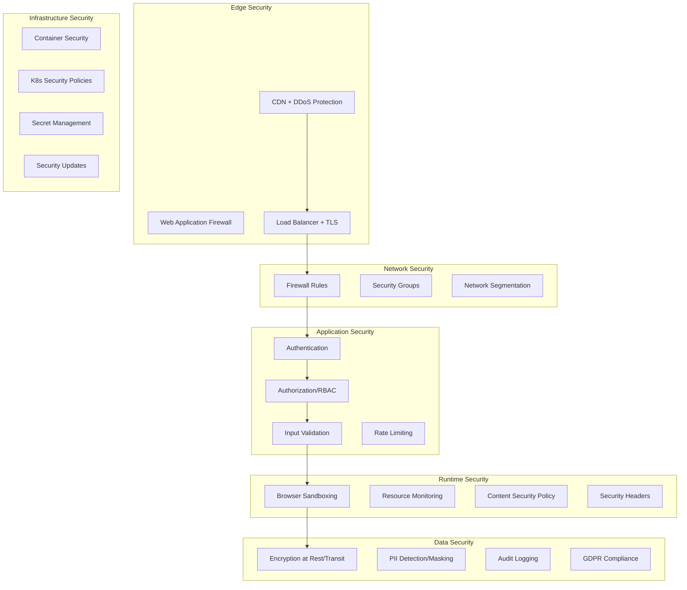
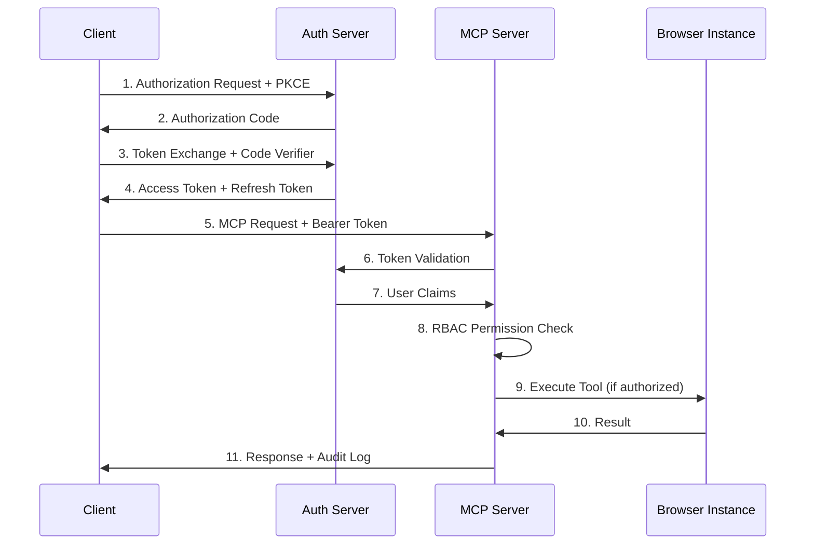

# Comprehensive Production Security Architecture
## Playwright MCP Server - Enterprise Security Framework

### Executive Summary

This document defines a comprehensive, defense-in-depth security architecture for the Playwright MCP server handling 150+ tools for browser automation in production environments. The architecture addresses authentication, authorization, input validation, resource protection, monitoring, and compliance requirements for enterprise deployment.

## 1. Security Architecture Overview

### 1.1 Defense-in-Depth Layers



### 1.2 Security Components

| Component | Technology | Purpose |
|-----------|------------|---------|
| Authentication | JWT + OAuth 2.1 + PKCE | Identity verification |
| Authorization | RBAC + Tool Annotations | Permission enforcement |
| Rate Limiting | Redis + Token Bucket | DoS protection |
| Input Validation | Zod Schemas + Sanitization | Injection prevention |
| Session Management | Redis + UUID v4 | Secure state handling |
| Audit Logging | Structured JSON + ELK | Security monitoring |
| Secret Management | HashiCorp Vault | Credential protection |
| Container Security | Distroless + Non-root | Runtime hardening |

## 2. Authentication & Authorization Architecture

### 2.1 OAuth 2.1 + PKCE Flow



### 2.2 Role-Based Access Control (RBAC)

#### Role Definitions

```typescript
interface SecurityRole {
  name: string;
  permissions: Permission[];
  toolAccess: ToolAccessMatrix;
  resourceLimits: ResourceLimits;
  sessionLimits: SessionLimits;
}

interface Permission {
  action: 'read' | 'write' | 'execute' | 'admin';
  resource: string;
  conditions?: Condition[];
}

interface ToolAccessMatrix {
  allowed: ToolCategory[];
  denied: string[];
  rateLimits: Record<string, RateLimit>;
}
```

## 3. Authorization Matrix for 150+ Tools

### 3.1 Role-Based Tool Access

| Role | Browser Mgmt | Navigation | Element Interaction | Capture | Network | JavaScript | Admin |
|------|-------------|------------|-------------------|---------|---------|------------|-------|
| **Super Admin** | ✅ All | ✅ All | ✅ All | ✅ All | ✅ All | ✅ All | ✅ All |
| **Admin** | ✅ All | ✅ All | ✅ All | ✅ All | ✅ Monitor Only | ❌ No | ✅ Limited |
| **Automation Engineer** | ✅ All | ✅ All | ✅ All | ✅ All | ✅ Monitor Only | ✅ Limited | ❌ No |
| **QA Tester** | ✅ Launch/Close | ✅ All | ✅ All | ✅ All | ✅ Monitor Only | ❌ No | ❌ No |
| **Developer** | ✅ Launch/Close | ✅ All | ✅ Read Only | ✅ Screenshots | ✅ Monitor Only | ✅ Limited | ❌ No |
| **Analyst** | ❌ No | ✅ Navigate Only | ✅ Read Only | ✅ Screenshots | ✅ Monitor Only | ❌ No | ❌ No |
| **Read Only** | ❌ No | ✅ Navigate Only | ✅ Read Only | ✅ Screenshots | ✅ Monitor Only | ❌ No | ❌ No |

### 3.2 Tool-Level Security Classifications

```typescript
interface ToolSecurityClassification {
  riskLevel: 'LOW' | 'MEDIUM' | 'HIGH' | 'CRITICAL';
  destructive: boolean;
  resourceIntensive: boolean;
  privilegeRequired: string[];
  rateLimitTier: 1 | 2 | 3 | 4 | 5;
  auditRequired: boolean;
  approvalRequired: boolean;
}
```

#### Critical Tools (Require Admin Approval)
- `browser_force_close_all`
- `execute_javascript_unsafe`
- `download_file_system_access`
- `network_intercept_modify`
- `storage_clear_all_data`

#### High-Risk Tools (Enhanced Logging)
- `element_drag_drop`
- `page_set_content`
- `file_upload_multiple`
- `storage_set_cookies`
- `network_intercept_requests`

## 4. Input Validation & Sanitization

### 4.1 Schema-Based Validation

```typescript
// High-risk tool validation schemas
export const HighRiskToolSchemas = {
  execute_javascript: z.object({
    sessionId: z.string().uuid(),
    code: z.string()
      .max(10000, 'Code too long')
      .refine(sanitizeJavaScript, 'Potentially unsafe JavaScript'),
    timeout: z.number().min(1000).max(30000).default(10000),
  }),
  
  file_upload: z.object({
    sessionId: z.string().uuid(),
    selector: z.string().regex(SAFE_SELECTOR_PATTERN),
    filePath: z.string().refine(validateFilePath, 'Invalid file path'),
    options: z.object({
      maxSize: z.number().max(100 * 1024 * 1024), // 100MB limit
      allowedTypes: z.array(z.enum(['image/*', 'text/*', 'application/pdf'])),
    }).optional(),
  }),

  network_intercept: z.object({
    sessionId: z.string().uuid(),
    pattern: z.string().url().or(z.string().regex(URL_PATTERN)),
    action: z.enum(['block', 'modify', 'log']),
    modifications: z.object({
      headers: z.record(z.string()).optional(),
      body: z.string().max(1024 * 1024).optional(), // 1MB limit
    }).optional(),
  }),
};

// Input sanitization functions
function sanitizeJavaScript(code: string): boolean {
  const DANGEROUS_PATTERNS = [
    /eval\s*\(/,
    /Function\s*\(/,
    /document\.write/,
    /innerHTML\s*=/,
    /setTimeout\s*\([^)]*string/,
    /setInterval\s*\([^)]*string/,
    /new\s+Function/,
    /import\s*\(/,
    /__proto__/,
    /constructor/,
  ];
  
  return !DANGEROUS_PATTERNS.some(pattern => pattern.test(code));
}

function validateFilePath(path: string): boolean {
  const FORBIDDEN_PATTERNS = [
    /\.\./,           // Path traversal
    /^\/etc\//,       // System directories
    /^\/proc\//,      // Process info
    /^\/sys\//,       // System info
    /\.exe$/,         // Executables
    /\.bat$/,         // Batch files
    /\.sh$/,          // Shell scripts
  ];
  
  return !FORBIDDEN_PATTERNS.some(pattern => pattern.test(path));
}
```

### 4.2 Content Security Policy (CSP)

```typescript
const CSP_POLICY = {
  'default-src': ["'self'"],
  'script-src': ["'self'", "'unsafe-inline'"], // Limited inline for Playwright
  'style-src': ["'self'", "'unsafe-inline'"],
  'img-src': ["'self'", "data:", "https:"],
  'connect-src': ["'self'", "wss:", "https:"],
  'font-src': ["'self'"],
  'object-src': ["'none'"],
  'base-uri': ["'self'"],
  'frame-ancestors': ["'none'"],
  'form-action': ["'self'"],
  'upgrade-insecure-requests': [],
};
```

## 5. Rate Limiting Configuration

### 5.1 Multi-Tier Rate Limiting

```typescript
interface RateLimitConfiguration {
  global: {
    requests: number;
    window: number;
    burst: number;
  };
  perUser: {
    requests: number;
    window: number;
    burst: number;
  };
  perTool: Record<string, {
    requests: number;
    window: number;
    priority: number;
  }>;
  perCategory: Record<ToolCategory, {
    requests: number;
    window: number;
  }>;
}

export const PRODUCTION_RATE_LIMITS: RateLimitConfiguration = {
  global: {
    requests: 10000,      // 10k requests
    window: 3600,         // per hour
    burst: 100,           // burst capacity
  },
  perUser: {
    requests: 1000,       // 1k requests
    window: 3600,         // per hour
    burst: 50,            // burst capacity
  },
  perTool: {
    // Critical tools - heavily limited
    'browser_launch': { requests: 10, window: 60, priority: 1 },
    'browser_force_close_all': { requests: 2, window: 300, priority: 1 },
    'execute_javascript_unsafe': { requests: 5, window: 60, priority: 1 },
    
    // Resource-intensive tools
    'page_screenshot_full': { requests: 30, window: 60, priority: 2 },
    'page_pdf_generate': { requests: 20, window: 60, priority: 2 },
    'network_har_export': { requests: 10, window: 60, priority: 2 },
    
    // High-frequency tools
    'element_click': { requests: 200, window: 60, priority: 3 },
    'element_fill': { requests: 200, window: 60, priority: 3 },
    'page_navigate': { requests: 100, window: 60, priority: 3 },
    
    // Read-only tools - less restricted
    'element_get_text': { requests: 500, window: 60, priority: 4 },
    'element_is_visible': { requests: 500, window: 60, priority: 4 },
    'page_get_title': { requests: 500, window: 60, priority: 4 },
  },
  perCategory: {
    [ToolCategory.BROWSER_MANAGEMENT]: { requests: 50, window: 60 },
    [ToolCategory.JAVASCRIPT_EXECUTION]: { requests: 20, window: 60 },
    [ToolCategory.DOWNLOADS_UPLOADS]: { requests: 30, window: 60 },
    [ToolCategory.NETWORK_API]: { requests: 100, window: 60 },
    [ToolCategory.PAGE_CAPTURE]: { requests: 50, window: 60 },
    [ToolCategory.ELEMENT_INTERACTION]: { requests: 300, window: 60 },
    [ToolCategory.ELEMENT_LOCATION]: { requests: 400, window: 60 },
    [ToolCategory.ELEMENT_INFORMATION]: { requests: 500, window: 60 },
    [ToolCategory.PAGE_NAVIGATION]: { requests: 150, window: 60 },
    [ToolCategory.WAITING_SYNC]: { requests: 200, window: 60 },
    [ToolCategory.AUTHENTICATION_STORAGE]: { requests: 100, window: 60 },
    [ToolCategory.DEVICE_EMULATION]: { requests: 50, window: 60 },
    [ToolCategory.INPUT_CONTROL]: { requests: 250, window: 60 },
    [ToolCategory.MULTI_CONTEXT]: { requests: 50, window: 60 },
    [ToolCategory.PERFORMANCE]: { requests: 30, window: 60 },
    [ToolCategory.ACCESSIBILITY]: { requests: 100, window: 60 },
    [ToolCategory.ADVANCED_FEATURES]: { requests: 20, window: 60 },
    [ToolCategory.DEBUG_INSPECTION]: { requests: 50, window: 60 },
  },
};
```

### 5.2 Adaptive Rate Limiting

```typescript
interface AdaptiveRateLimit {
  baseLimit: number;
  scalingFactor: number;
  healthThreshold: number;
  loadFactors: {
    cpu: number;
    memory: number;
    activeConnections: number;
  };
}

class AdaptiveRateLimiter {
  calculateDynamicLimit(toolName: string, systemHealth: SystemHealth): number {
    const baseLimit = PRODUCTION_RATE_LIMITS.perTool[toolName]?.requests || 100;
    
    // Reduce limits under high system load
    const loadFactor = Math.min(
      systemHealth.cpu / 80,        // Scale down if CPU > 80%
      systemHealth.memory / 85,     // Scale down if memory > 85%
      systemHealth.connections / 1000  // Scale down if connections > 1000
    );
    
    return Math.floor(baseLimit * (1 - Math.max(0, loadFactor - 1)));
  }
}
```

## 6. Security Middleware Implementation

### 6.1 Enhanced Security Middleware

```typescript
export class EnhancedSecurityMiddleware extends SecurityMiddleware {
  private anomalyDetector: AnomalyDetector;
  private threatIntelligence: ThreatIntelligence;
  private complianceValidator: ComplianceValidator;

  /**
   * Advanced threat detection middleware
   */
  threatDetection() {
    return async (req: Request, res: Response, next: NextFunction) => {
      const threat = await this.detectThreats(req);
      
      if (threat.riskScore > THREAT_THRESHOLD) {
        await this.logSecurityEvent('THREAT_DETECTED', {
          ip: req.ip,
          userAgent: req.get('User-Agent'),
          threat: threat,
          timestamp: new Date().toISOString(),
        });
        
        if (threat.riskScore > BLOCK_THRESHOLD) {
          return res.status(403).json({
            error: {
              code: 'THREAT_DETECTED',
              message: 'Request blocked due to security threat',
            },
          });
        }
      }
      
      // Add threat context to request
      (req as any).threatContext = threat;
      next();
    };
  }

  /**
   * Browser-specific security validation
   */
  validateBrowserSecurity() {
    return async (req: Request, res: Response, next: NextFunction) => {
      const { sessionId, toolName } = req.body;
      
      if (!sessionId || !this.isValidSessionId(sessionId)) {
        return res.status(400).json({
          error: {
            code: 'INVALID_SESSION',
            message: 'Valid session ID required',
          },
        });
      }
      
      // Validate browser instance security
      const session = await this.sessionManager.getSession(sessionId);
      if (session && !this.validateBrowserSecurity(session.browser)) {
        return res.status(403).json({
          error: {
            code: 'BROWSER_SECURITY_VIOLATION',
            message: 'Browser instance failed security validation',
          },
        });
      }
      
      next();
    };
  }

  /**
   * Tool-specific authorization
   */
  authorizeToolExecution(toolName: string) {
    return async (req: Request, res: Response, next: NextFunction) => {
      const user = (req as any).user as User;
      const tool = this.toolRegistry.getTool(toolName);
      
      if (!tool) {
        return res.status(404).json({
          error: {
            code: 'TOOL_NOT_FOUND',
            message: `Tool ${toolName} not found`,
          },
        });
      }
      
      // Check tool-specific permissions
      const hasPermission = await this.checkToolPermission(user, tool);
      if (!hasPermission) {
        await this.logSecurityEvent('AUTHORIZATION_FAILED', {
          userId: user.id,
          toolName,
          reason: 'Insufficient tool permissions',
        });
        
        return res.status(403).json({
          error: {
            code: 'TOOL_ACCESS_DENIED',
            message: `Access denied for tool ${toolName}`,
          },
        });
      }
      
      // Check if tool requires approval
      if (tool.metadata.annotations.destructive && !user.permissions.includes('approve:destructive')) {
        return res.status(403).json({
          error: {
            code: 'APPROVAL_REQUIRED',
            message: `Tool ${toolName} requires administrative approval`,
          },
        });
      }
      
      next();
    };
  }

  private async detectThreats(req: Request): Promise<ThreatAssessment> {
    const indicators = {
      suspiciousUserAgent: this.checkSuspiciousUserAgent(req.get('User-Agent')),
      rapidRequests: await this.checkRapidRequests(req.ip),
      maliciousPayload: this.scanPayloadForThreats(req.body),
      anomalousPattern: await this.anomalyDetector.analyze(req),
      knownBadActor: await this.threatIntelligence.checkIP(req.ip),
    };
    
    const riskScore = this.calculateRiskScore(indicators);
    
    return {
      riskScore,
      indicators,
      timestamp: new Date(),
      recommendation: riskScore > BLOCK_THRESHOLD ? 'BLOCK' : 'MONITOR',
    };
  }
}
```

## 7. Audit Logging Schema

### 7.1 Structured Security Events

```typescript
interface SecurityAuditEvent {
  timestamp: string;
  eventId: string;
  eventType: SecurityEventType;
  severity: 'LOW' | 'MEDIUM' | 'HIGH' | 'CRITICAL';
  source: {
    ip: string;
    userAgent: string;
    userId?: string;
    sessionId?: string;
  };
  target: {
    resource: string;
    action: string;
    toolName?: string;
  };
  outcome: 'SUCCESS' | 'FAILURE' | 'BLOCKED';
  details: Record<string, any>;
  compliance: {
    gdpr: boolean;
    sox: boolean;
    pci: boolean;
  };
  retention: {
    category: 'SECURITY' | 'AUDIT' | 'COMPLIANCE';
    retentionDays: number;
  };
}

enum SecurityEventType {
  AUTHENTICATION_SUCCESS = 'auth.success',
  AUTHENTICATION_FAILURE = 'auth.failure',
  AUTHORIZATION_GRANTED = 'authz.granted',
  AUTHORIZATION_DENIED = 'authz.denied',
  TOOL_EXECUTION_START = 'tool.start',
  TOOL_EXECUTION_SUCCESS = 'tool.success',
  TOOL_EXECUTION_FAILURE = 'tool.failure',
  RATE_LIMIT_EXCEEDED = 'rate_limit.exceeded',
  THREAT_DETECTED = 'security.threat',
  DATA_ACCESS = 'data.access',
  CONFIGURATION_CHANGE = 'config.change',
  PRIVILEGE_ESCALATION = 'privilege.escalation',
  COMPLIANCE_VIOLATION = 'compliance.violation',
}
```

### 7.2 Audit Log Retention Policy

```typescript
const AUDIT_RETENTION_POLICY = {
  SECURITY_EVENTS: {
    retentionDays: 2555, // 7 years for security events
    archiveAfterDays: 365,
    compressionEnabled: true,
    encryptionRequired: true,
  },
  TOOL_EXECUTIONS: {
    retentionDays: 1095, // 3 years for tool usage
    archiveAfterDays: 90,
    compressionEnabled: true,
    encryptionRequired: false,
  },
  AUTHENTICATION_LOGS: {
    retentionDays: 1825, // 5 years for authentication
    archiveAfterDays: 180,
    compressionEnabled: true,
    encryptionRequired: true,
  },
  COMPLIANCE_LOGS: {
    retentionDays: 2555, // 7 years for compliance
    archiveAfterDays: 365,
    compressionEnabled: true,
    encryptionRequired: true,
  },
};
```

## 8. Incident Response Procedures

### 8.1 Security Incident Classification

| Level | Description | Response Time | Escalation |
|-------|-------------|---------------|------------|
| **P0 - Critical** | System breach, data leak, service compromise | < 15 minutes | CTO, CISO, Legal |
| **P1 - High** | Privilege escalation, authentication bypass | < 30 minutes | Security Team Lead |
| **P2 - Medium** | Rate limit bypass, suspicious activity | < 2 hours | On-call Engineer |
| **P3 - Low** | Minor configuration issues, false positives | < 24 hours | Security Team |

### 8.2 Automated Response Actions

```typescript
interface IncidentResponse {
  eventType: SecurityEventType;
  severity: 'LOW' | 'MEDIUM' | 'HIGH' | 'CRITICAL';
  automaticActions: AutomatedAction[];
  manualActions: ManualAction[];
  notificationTargets: string[];
}

const INCIDENT_RESPONSE_PLAYBOOK: Record<SecurityEventType, IncidentResponse> = {
  [SecurityEventType.THREAT_DETECTED]: {
    eventType: SecurityEventType.THREAT_DETECTED,
    severity: 'HIGH',
    automaticActions: [
      { type: 'BLOCK_IP', duration: 3600 },
      { type: 'TERMINATE_SESSION' },
      { type: 'ALERT_SECURITY_TEAM' },
      { type: 'INCREASE_MONITORING' },
    ],
    manualActions: [
      { type: 'INVESTIGATE_SOURCE', priority: 'HIGH' },
      { type: 'REVIEW_LOGS', priority: 'MEDIUM' },
      { type: 'UPDATE_THREAT_INTEL', priority: 'LOW' },
    ],
    notificationTargets: ['security-team@company.com', 'on-call@company.com'],
  },
  
  [SecurityEventType.PRIVILEGE_ESCALATION]: {
    eventType: SecurityEventType.PRIVILEGE_ESCALATION,
    severity: 'CRITICAL',
    automaticActions: [
      { type: 'DISABLE_USER_ACCOUNT' },
      { type: 'REVOKE_ALL_TOKENS' },
      { type: 'ALERT_CISO' },
      { type: 'PRESERVE_EVIDENCE' },
    ],
    manualActions: [
      { type: 'FORENSIC_ANALYSIS', priority: 'CRITICAL' },
      { type: 'LEGAL_NOTIFICATION', priority: 'HIGH' },
      { type: 'THREAT_HUNTING', priority: 'HIGH' },
    ],
    notificationTargets: ['ciso@company.com', 'legal@company.com'],
  },
};
```

## 9. Container & Kubernetes Security

### 9.1 Hardened Container Configuration

```dockerfile
# Security-hardened Dockerfile
FROM node:18-alpine AS base

# Create non-root user
RUN addgroup -g 1001 -S playwright && \
    adduser -S playwright -u 1001

# Install security updates
RUN apk update && apk upgrade && \
    apk add --no-cache dumb-init

# Install Playwright with minimal dependencies
FROM base AS dependencies
WORKDIR /app
COPY package*.json ./
RUN npm ci --only=production --ignore-scripts

FROM base AS runtime
WORKDIR /app

# Copy application files
COPY --from=dependencies /app/node_modules ./node_modules
COPY --chown=playwright:playwright . .

# Security: Remove package manager and unnecessary files
RUN npm uninstall -g npm && \
    rm -rf /var/cache/apk/* /tmp/* /var/tmp/* && \
    chmod -R 755 /app

# Drop to non-root user
USER playwright:playwright

# Use dumb-init for proper signal handling
ENTRYPOINT ["dumb-init", "--"]
CMD ["node", "dist/index.js"]

# Security labels
LABEL security.scan="enabled" \
      security.non-root="true" \
      security.read-only="true"
```

### 9.2 Kubernetes Security Policies

```yaml
# Pod Security Policy
apiVersion: policy/v1beta1
kind: PodSecurityPolicy
metadata:
  name: playwright-mcp-psp
spec:
  privileged: false
  allowPrivilegeEscalation: false
  requiredDropCapabilities:
    - ALL
  volumes:
    - 'configMap'
    - 'emptyDir'
    - 'projected'
    - 'secret'
    - 'downwardAPI'
    - 'persistentVolumeClaim'
  runAsUser:
    rule: 'MustRunAsNonRoot'
    ranges:
      - min: 1001
        max: 1001
  runAsGroup:
    rule: 'MustRunAs'
    ranges:
      - min: 1001
        max: 1001
  seLinux:
    rule: 'RunAsAny'
  fsGroup:
    rule: 'RunAsAny'
  readOnlyRootFilesystem: true
  
---
# Network Policy
apiVersion: networking.k8s.io/v1
kind: NetworkPolicy
metadata:
  name: playwright-mcp-netpol
spec:
  podSelector:
    matchLabels:
      app: playwright-mcp
  policyTypes:
  - Ingress
  - Egress
  ingress:
  - from:
    - podSelector:
        matchLabels:
          app: api-gateway
    ports:
    - protocol: TCP
      port: 3000
  egress:
  - to:
    - podSelector:
        matchLabels:
          app: redis
    ports:
    - protocol: TCP
      port: 6379
  - to: [] # Allow external HTTP/HTTPS for browser operations
    ports:
    - protocol: TCP
      port: 80
    - protocol: TCP
      port: 443

---
# Security Context
apiVersion: apps/v1
kind: Deployment
metadata:
  name: playwright-mcp
spec:
  template:
    spec:
      securityContext:
        runAsNonRoot: true
        runAsUser: 1001
        runAsGroup: 1001
        fsGroup: 1001
        seccompProfile:
          type: RuntimeDefault
      containers:
      - name: playwright-mcp
        securityContext:
          allowPrivilegeEscalation: false
          readOnlyRootFilesystem: true
          runAsNonRoot: true
          runAsUser: 1001
          capabilities:
            drop:
            - ALL
        resources:
          limits:
            cpu: "2"
            memory: "4Gi"
            ephemeral-storage: "10Gi"
          requests:
            cpu: "500m"
            memory: "1Gi"
            ephemeral-storage: "2Gi"
```

## 10. Security Testing Strategy

### 10.1 Automated Security Checks

```typescript
describe('Security Test Suite', () => {
  describe('Authentication & Authorization', () => {
    test('should reject invalid JWT tokens', async () => {
      const response = await request(app)
        .post('/mcp/tools/call')
        .set('Authorization', 'Bearer invalid-token')
        .send({ name: 'page_navigate', arguments: {} });
      
      expect(response.status).toBe(401);
      expect(response.body.error.code).toBe('INVALID_TOKEN');
    });
    
    test('should enforce RBAC for destructive tools', async () => {
      const userToken = generateToken({ role: 'readonly' });
      
      const response = await request(app)
        .post('/mcp/tools/call')
        .set('Authorization', `Bearer ${userToken}`)
        .send({ name: 'browser_force_close_all', arguments: {} });
      
      expect(response.status).toBe(403);
      expect(response.body.error.code).toBe('TOOL_ACCESS_DENIED');
    });
  });

  describe('Input Validation', () => {
    test('should sanitize JavaScript code execution', async () => {
      const maliciousCode = 'eval("malicious code"); document.write("XSS");';
      
      const response = await request(app)
        .post('/mcp/tools/call')
        .set('Authorization', `Bearer ${adminToken}`)
        .send({
          name: 'execute_javascript',
          arguments: { sessionId: validSessionId, code: maliciousCode }
        });
      
      expect(response.status).toBe(400);
      expect(response.body.error.code).toBe('VALIDATION_ERROR');
    });
    
    test('should prevent path traversal attacks', async () => {
      const maliciousPath = '../../../etc/passwd';
      
      const response = await request(app)
        .post('/mcp/tools/call')
        .set('Authorization', `Bearer ${userToken}`)
        .send({
          name: 'file_upload',
          arguments: { sessionId: validSessionId, filePath: maliciousPath }
        });
      
      expect(response.status).toBe(400);
      expect(response.body.error.details).toContain('Invalid file path');
    });
  });

  describe('Rate Limiting', () => {
    test('should enforce global rate limits', async () => {
      const promises = Array(101).fill(0).map(() =>
        request(app)
          .post('/mcp/tools/list')
          .set('Authorization', `Bearer ${userToken}`)
      );
      
      const responses = await Promise.all(promises);
      const rateLimitedResponses = responses.filter(r => r.status === 429);
      
      expect(rateLimitedResponses.length).toBeGreaterThan(0);
    });
    
    test('should enforce tool-specific rate limits', async () => {
      // Test browser launch rate limiting
      const promises = Array(15).fill(0).map(() =>
        request(app)
          .post('/mcp/tools/call')
          .set('Authorization', `Bearer ${userToken}`)
          .send({ name: 'browser_launch', arguments: {} })
      );
      
      const responses = await Promise.all(promises);
      const rateLimitedResponses = responses.filter(r => r.status === 429);
      
      expect(rateLimitedResponses.length).toBeGreaterThan(0);
    });
  });
});
```

### 10.2 Security Performance Benchmarks

```typescript
interface SecurityBenchmark {
  name: string;
  target: number;
  unit: string;
  test: () => Promise<number>;
}

const SECURITY_BENCHMARKS: SecurityBenchmark[] = [
  {
    name: 'JWT Token Validation',
    target: 1000,
    unit: 'ops/sec',
    test: async () => {
      const token = generateToken({ role: 'user' });
      const start = performance.now();
      
      for (let i = 0; i < 1000; i++) {
        jwt.verify(token, JWT_SECRET);
      }
      
      const duration = performance.now() - start;
      return 1000 / (duration / 1000);
    },
  },
  
  {
    name: 'Rate Limit Check',
    target: 10000,
    unit: 'ops/sec',
    test: async () => {
      const start = performance.now();
      
      for (let i = 0; i < 10000; i++) {
        await rateLimiter.consume('test-key');
      }
      
      const duration = performance.now() - start;
      return 10000 / (duration / 1000);
    },
  },
  
  {
    name: 'Input Validation',
    target: 5000,
    unit: 'ops/sec',
    test: async () => {
      const schema = HighRiskToolSchemas.execute_javascript;
      const input = { sessionId: 'test-id', code: 'console.log("test");' };
      const start = performance.now();
      
      for (let i = 0; i < 5000; i++) {
        schema.parse(input);
      }
      
      const duration = performance.now() - start;
      return 5000 / (duration / 1000);
    },
  },
];
```

## 11. Compliance Framework

### 11.1 GDPR Compliance

```typescript
class GDPRComplianceManager {
  async handleDataSubjectRequest(request: DataSubjectRequest): Promise<void> {
    switch (request.type) {
      case 'ACCESS':
        await this.exportUserData(request.userId);
        break;
      case 'DELETE':
        await this.deleteUserData(request.userId);
        break;
      case 'PORTABILITY':
        await this.exportUserDataPortable(request.userId);
        break;
      case 'RECTIFICATION':
        await this.updateUserData(request.userId, request.updates);
        break;
    }
  }
  
  async anonymizeAuditLogs(userId: string): Promise<void> {
    // Replace PII in audit logs with anonymized identifiers
    await this.auditLogger.anonymizeUserData(userId);
  }
}
```

### 11.2 SOC 2 Controls

| Control | Implementation | Evidence |
|---------|----------------|----------|
| **CC1.1** | Governance structure | Security policies, role definitions |
| **CC2.1** | Logical access controls | RBAC implementation, audit logs |
| **CC3.1** | Risk assessment | Threat modeling, vulnerability scans |
| **CC4.1** | Monitoring activities | Security monitoring, incident response |
| **CC5.1** | Control activities | Input validation, rate limiting |
| **CC6.1** | Logical physical access | Container security, network policies |
| **CC7.1** | System operation | Deployment security, patch management |
| **CC8.1** | Change management | Configuration management, approval workflows |

## 12. Monitoring & Alerting

### 12.1 Security Metrics Dashboard

```typescript
interface SecurityMetrics {
  authentication: {
    successRate: number;
    failureCount: number;
    suspiciousAttempts: number;
  };
  authorization: {
    deniedRequests: number;
    privilegeEscalationAttempts: number;
  };
  rateLimit: {
    throttledRequests: number;
    blockedIPs: string[];
  };
  threats: {
    detectedThreats: number;
    blockedRequests: number;
    riskScore: number;
  };
  compliance: {
    gdprRequests: number;
    auditLogIntegrity: boolean;
    retentionCompliance: boolean;
  };
}
```

### 12.2 Real-time Security Alerts

```typescript
const SECURITY_ALERTS = {
  CRITICAL: {
    threshold: 0.99,
    targets: ['security-team@company.com', 'ciso@company.com'],
    escalation: 'IMMEDIATE',
  },
  HIGH: {
    threshold: 0.8,
    targets: ['security-team@company.com'],
    escalation: '15_MINUTES',
  },
  MEDIUM: {
    threshold: 0.6,
    targets: ['on-call@company.com'],
    escalation: '1_HOUR',
  },
  LOW: {
    threshold: 0.4,
    targets: ['security-logs@company.com'],
    escalation: '24_HOURS',
  },
};
```

This comprehensive security architecture provides enterprise-grade protection for the Playwright MCP server while maintaining performance and usability. The defense-in-depth approach ensures multiple layers of security controls protect against various threat vectors.